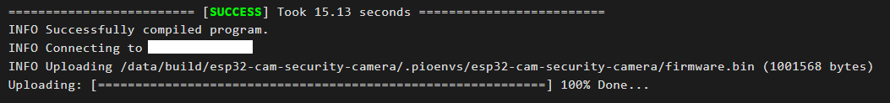
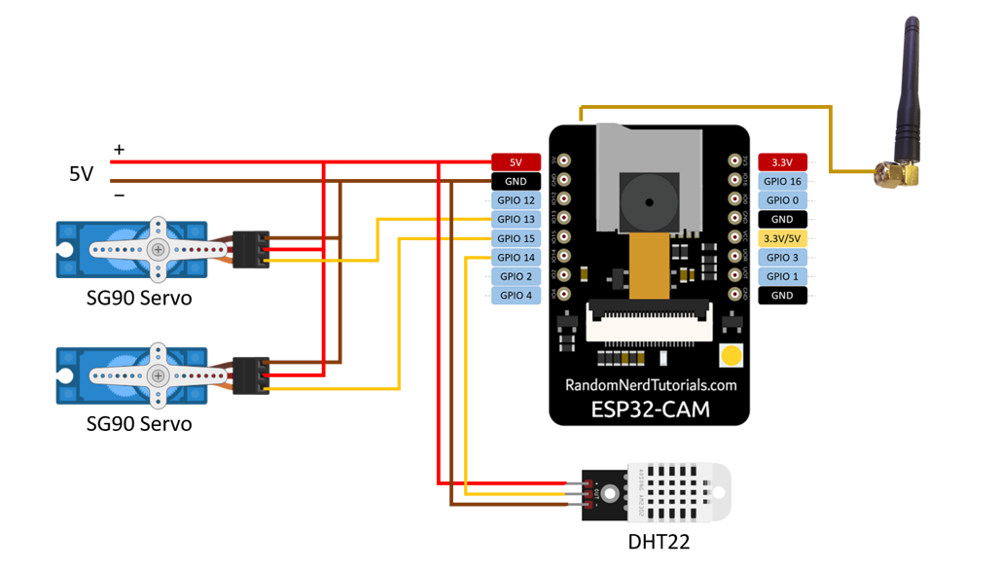

# Make a Security Camera in Home Assistant

##TODO: Implementation video

## Home Assistant  

**Home Assistant** is a powerful, open-source smart home system that allows users to manage various smart devices in their home. With Home Assistant, you can control all your smart devices—such as lights, cameras, door locks, TVs, and air conditioners—from a single platform.

In addition to being compatible with commercially available smart home products, you can also create your own low-cost smart devices using development boards with internet connectivity. These DIY modules can be integrated into the smart system, offering a cost-effective solution for home automation.

## ESPHome 

Once setting up Home Assistant system, you have install **ESPHome** and make sure it is avaliable. The ESP32-Cam will integrate in Home Assistant through ESPHome system. 

* **ESPHome installation**: \
Home Assistant ⇒ Settings ⇒ **Add-ons** ⇒ **ADD-ON STORE** (on lower-right) ⇒ Search for **ESPHome** ⇒ click **INSTALL**.

## ESP32-Cam
The next step is to add ESP32-Cam to ESPHome. For the first time programming ESP32 from ESPHome, it have to connect to USB port by a **'USB to TTL'** converter. Please follow the schematic diagram below and connect to your computer. 


\
Then connect ESP32 board to ESPHome by the following steps. 

* **ESP32-Cam connection**: \
Go in ESPHome tab ⇒ click **NEW DEVICE** ⇒ **OPEN ESPHOME WEB** ⇒ **CONNECT** ⇒ select the USB Serial port ⇒ **PREPARE FOR FIRST USE** ⇒ Follow the instruction and wait for few minutes. \
\
After seeing **Configuration Installed!** panel: \
Click **" ⁝ "** botton ⇒ **Configure Wi-Fi** ⇒ Select Wi-Fi and enter your password to make sure ESP32-Cam can connect to Home Assistant wirelessly. 

<br/>

* **Upload configuration:** \
In ESPHome tab of Home Assistant, click **adopt** and follow the following instructions. Then **EDIT** the ```.yaml``` file, copy and paste all of the code from [```esp32cam.yaml```](esp32cam.yaml). Finally, just click **SAVE** and **INSTALL** to upload configuration. From now on, you can choose install **wirelessly**, just make sure ESP32-Cam is powered and connected to Wi-Fi. And wait for few minutes until seeing the *SUCCESS* info. 



 Now, ESP32-Cam has been added to ESPHome and you can check by **"VISIT"** the divice web. 

 ## Circuit
Connect wires by following circuit. \
It's better to give a 5V power supply for image transmission, you can just connect to a not-in-use phone charger. **GPIO13** is for servo turning up and down, and **GPIO15** for left and right. **GPIO14** uses for humidity and temperature sensor (DHT22). I recommend to replace an external 2.4G antenna to get a better signal. Please see [here](https://randomnerdtutorials.com/esp32-cam-connect-external-antenna/) or this [video](https://www.youtube.com/watch?v=aBTZuvg5sM8&t=1s) to learn how to connect an external antenna. 

<div align=left>

</div>

Find a suitable case and install the 2 SG90s on the steering gear. A sercurity camera with temperature and humidity sensor is successfully done for Home Assistant!